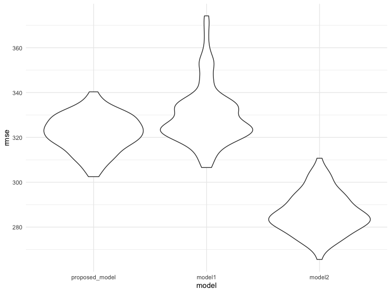

p8105\_hw6\_yy2912
================
Roxana Yan
19/11/2019

``` r
library(modelr)
library(tidyverse)
```

load data

``` r
birthweight = 
  read_csv('./Data/birthweight.csv') 
```

\#problem 1 clean data

``` r
birthweight_clean = 
  birthweight %>% 
  janitor::clean_names()%>%
  mutate(
    babysex = fct_infreq(as.factor(babysex)),
    frace = fct_infreq(as.factor(frace)),
    malform = fct_infreq(as.factor(malform)),
    mrace = fct_infreq(as.factor(mrace))
  )
```

``` r
birthweight_clean %>% 
filter(is.na(bwt))
```

    ## # A tibble: 0 x 20
    ## # … with 20 variables: babysex <fct>, bhead <dbl>, blength <dbl>,
    ## #   bwt <dbl>, delwt <dbl>, fincome <dbl>, frace <fct>, gaweeks <dbl>,
    ## #   malform <fct>, menarche <dbl>, mheight <dbl>, momage <dbl>,
    ## #   mrace <fct>, parity <dbl>, pnumlbw <dbl>, pnumsga <dbl>, ppbmi <dbl>,
    ## #   ppwt <dbl>, smoken <dbl>, wtgain <dbl>

there is no missing data in this dataset

proposed model: the model I proposed include several factors that may
associate with baby’s birthweight. baby’s birthweights may be associated
with baby’s sex, baby’s head circumferences, mother’s weight at
delivery, mother’s age at delivery, mother’s pre-pregnancy
BMI.

``` r
proposed_model = lm(bwt ~ babysex + bhead + delwt + momage + gaweeks + ppbmi, data = birthweight_clean)
```

``` r
proposed_model %>% 
  broom::glance()%>%
  knitr::kable()
```

| r.squared | adj.r.squared |    sigma | statistic | p.value | df |     logLik |      AIC |      BIC |  deviance | df.residual |
| --------: | ------------: | -------: | --------: | ------: | -: | ---------: | -------: | -------: | --------: | ----------: |
| 0.6031189 |     0.6025695 | 322.8726 |  1097.944 |       0 |  7 | \-31242.38 | 62500.76 | 62551.77 | 451909580 |        4335 |

the overall model has a p-value of close to 0, which is smaller than
alpha of 0.05, meaning that the model proposed is a reasonable model for
the outcome, birthweight

``` r
proposed_model %>% 
  broom::tidy()%>%
knitr::kable()
```

| term        |      estimate |   std.error |   statistic |   p.value |
| :---------- | ------------: | ----------: | ----------: | --------: |
| (Intercept) | \-5184.252473 | 110.7834793 | \-46.796260 | 0.0000000 |
| babysex2    |     27.186480 |   9.9938744 |    2.720314 | 0.0065480 |
| bhead       |    208.768379 |   3.3990688 |   61.419287 | 0.0000000 |
| delwt       |      5.060028 |   0.3271679 |   15.466149 | 0.0000000 |
| momage      |      5.866106 |   1.2790964 |    4.586133 | 0.0000046 |
| gaweeks     |     21.564239 |   1.6958310 |   12.716031 | 0.0000000 |
| ppbmi       |   \-20.661413 |   2.2392307 |  \-9.227014 | 0.0000000 |

in addition, all predcitors included in the model have p-values smaller
than alpha of 0.05, meaning that each of them is independtly associated
with the outcome birthweight and the association is statistically
significant.

``` r
birthweight_clean %>% 
modelr::add_residuals(proposed_model) %>% 
modelr::add_predictions(proposed_model) %>% 
  ggplot(aes(x = pred, y = resid)) + 
  geom_point()+
  labs(
    title = 'Model residuals against fitted values',
    x = 'Fitted values',
    y = 'Residuals'
  )
```


compare two
models

``` r
model1 = lm(bwt ~ blength + gaweeks, data = birthweight_clean)
```

``` r
model2 = lm(bwt ~ bhead + blength + babysex + bhead * blength + bhead * babysex + blength * babysex, data = birthweight_clean)
```

``` r
library(mgcv)
```

    ## Loading required package: nlme

    ## 
    ## Attaching package: 'nlme'

    ## The following object is masked from 'package:dplyr':
    ## 
    ##     collapse

    ## This is mgcv 1.8-28. For overview type 'help("mgcv-package")'.

``` r
cv_df= crossv_mc (birthweight_clean, 100)%>%

  mutate(
    train = map(train, as_tibble),
    test = map(test, as_tibble))

cv_results=cv_df%>%
  mutate(proposed_model= map(train,~proposed_model),
         model1= map(train,~model1),
         model2= map(train,~model2)
         )%>%
  mutate(rmse_proposed_model = map2_dbl(proposed_model, test, ~rmse(model = .x, data = .y)),
         rmse_model1 = map2_dbl(model1, test, ~rmse(model = .x, data = .y)),
         rmse_model2 = map2_dbl(model2, test, ~rmse(model = .x, data = .y)))
```

``` r
cv_results%>% 
  select(starts_with("rmse")) %>% 
  pivot_longer(
    everything(),
    names_to = "model", 
    values_to = "rmse",
    names_prefix = "rmse_") %>% 
  mutate(model = fct_inorder(model)) %>% 
  ggplot(aes(x = model, y = rmse)) + geom_violin()
```



The violin graph shows the variance in prediction error across methods
and model 2 has the smallest variance and is the best of the three.

\#problem 2

``` r
weather_df = 
  rnoaa::meteo_pull_monitors(
    c("USW00094728"),
    var = c("PRCP", "TMIN", "TMAX"), 
    date_min = "2017-01-01",
    date_max = "2017-12-31") %>%
  mutate(
    name = recode(id, USW00094728 = "CentralPark_NY"),
    tmin = tmin / 10,
    tmax = tmax / 10) %>%
  select(name, id, everything())
```

    ## Registered S3 method overwritten by 'crul':
    ##   method                 from
    ##   as.character.form_file httr

    ## Registered S3 method overwritten by 'hoardr':
    ##   method           from
    ##   print.cache_info httr

    ## file path:          /Users/Roxana/Library/Caches/rnoaa/ghcnd/USW00094728.dly

    ## file last updated:  2019-11-22 21:46:01

    ## file min/max dates: 1869-01-01 / 2019-11-30
